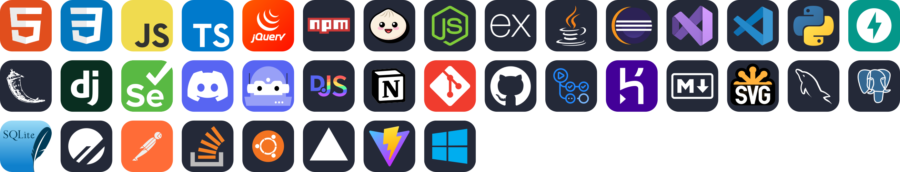
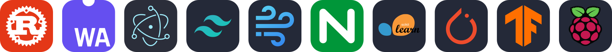

<!-- 
1. https://skillicons.dev/icons より、リクエスト負荷軽減のため、svg画像をDL
2. https://convertio.co/ja/svg-webp/ より、svgをwebpへ変換(svgも外部にリクエストするため)
-->

# My Skills

<!-- https://skillicons.dev/icons?i=html,css,js,ts,jquery,npm,bun,nodejs,express,java,eclipse,visualstudio,vscode,py,fastapi,flask,django,selenium,discord,bots,discordjs,notion,git,github,githubactions,heroku,md,svg,mysql,postgres,sqlite,planetscale,postman,stackoverflow,ubuntu,vercel,vite,windows, -->

a few more.

# Studying Now

<!-- https://skillicons.dev/icons?i=linux,kali,docker,kubernetes,rust,go, -->

# Study Canceled

<!-- https://skillicons.dev/icons?i=spring,react,nextjs,prisma,sass,materialui, -->

- キャンセルした理由
  - 新規需要の低迷(競合多数)
  - 破壊的変更による堅牢性の懸念や、学習コストの増加
  - 飽和状態のスキル

# Future Study

<!-- https://skillicons.dev/icons?i=wasm,mongodb,graphql,tailwind,windicss,nginx,sklearn,pytorch,tensorflow,raspberrypi, -->

# My User Icon

[フリーペンシル](https://iconbu.com/)
